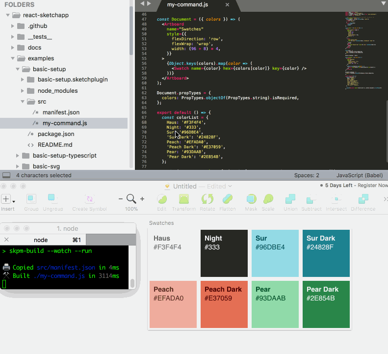

# Examples

`react-sketchapp` is bundled with lots of examples!

If you're having trouble running the examples or are new to the command line, see the **[detailed setup instructions below](#running-the-examples-from-scratch)**

### [Basic setup](https://github.com/airbnb/react-sketchapp/tree/master/examples/basic-setup)


### [Styleguide](https://github.com/airbnb/react-sketchapp/tree/master/examples/styleguide)


### [Profile Cards](https://github.com/airbnb/react-sketchapp/tree/master/examples/profile-cards)


### [Profile Cards on Web + Sketch w/ `react-primitives`](https://github.com/airbnb/react-sketchapp/tree/master/examples/profile-cards-primitives)


### [Profile Cards w/ `react-with-styles`](https://github.com/airbnb/react-sketchapp/tree/master/examples/profile-cards-react-with-styles)


### [Profile Cards w/ GraphQL](https://github.com/airbnb/react-sketchapp/tree/master/examples/profile-cards-graphql)


### [Venue Search on Web + Sketch w/ `react-primitives`, Foursquare & Google Maps](https://github.com/airbnb/react-sketchapp/tree/master/examples/foursquare-maps)


### [Generative Colors w/ chroma-js](https://github.com/airbnb/react-sketchapp/tree/master/examples/colors)


### [Timeline w/ Airtable](https://github.com/airbnb/react-sketchapp/tree/master/examples/timeline-airtable)


### [Basic setup w/ Typescript](../examples/basic-setup-typescript)


## Running the examples from scratch


### Step 0: Gather all your tools

Before getting started with react-sketch-app you should have all the following tools installed and ready to go:

- [ ] A terminal program (if you are not very comfortable using the command line, [this guide](http://wiseheartdesign.com/articles/2010/11/12/the-designers-guide-to-the-osx-command-prompt/) should teach you most of the basic commands to get up and running)

- [ ] Sketch

- [ ] A Text editor ([Atom](https://atom.io/) or [Sublime Text](https://www.sublimetext.com/) are straightforward choices with which to start and both have many of tutorials available online)

- [ ] A recent version of NodeJS/NPM (If you type ```node -v``` in your terminal and do not see a version number go ahead and install it from the official [Node.js® website](https://nodejs.org), the button with "LTS" should be exactly what you need)

- [ ] Git (If you type ```git --version``` in your terminal and do not see a version number go ahead and install git for your operating system from the [git website](https://git-scm.com/downloads))

### Step 1: Clone react-sketchapp

Assuming all your tools are installed/working, we're ready to get started by getting ```react-sketchapp``` onto your machine

- [ ] Open a terminal and change the directory into a folder where you want react-sketchapp to live (if you're not sure or don't really care, an easy choice is to put it right on your desktop. You can move your terminal inside there by typing ```cd ~/Desktop``` & verify you're inside that directory by typing ```pwd``` to see the full path. ```cd ..``` will move you back one folder)

- [ ] You now can clone or download react-sketchapp to the directory from the step above by copying the following command into your terminal:

```sh
git clone https://github.com/airbnb/react-sketchapp.git
```

Note: This should take a couple seconds and once it's finished you can type ```ls -1``` in your terminal to see an alphabetized list of all the folders & ```react-sketchapp``` should be one of them


### Step 2: Run the first example, "basic-setup"

- [ ] Now that ```react-sketchapp``` is on your machine move the terminal into the folder you just cloned down by typing the following command:

```sh
cd react-sketchapp
``` 

- [ ] From the ```react-sketchapp``` directory, move into the examples folder and then move into the basic-setup folder by typing the following commands:

```sh
cd examples
cd basic-setup
```

(Again you can see the terminal's current location by typing ```pwd``` and also list all the files inside that directory by typing ```ls -1```)

- [ ] Install the dependencies/helper-files by typing the following command:
 
 ```sh
 npm install
 ``` 

 (If you see wall of text zoom down your screen that means [npm](https://www.npmjs.com/) is working as expected)

- [ ] While it's installing, take a break from the terminal and open Sketch and select "New Document" (note that Sketch should be open to an empty file before running any of the examples)

- [ ] Open the folder ```react-sketchapp``` in your text editor and drill down to react-sketchapp -> examples -> basic-setup -> src -> my-command.js (no need to do anything with it yet) 

- [ ] Once the ```npm install``` command completes start the example by entering the following command inside the basic-setup folder:

```sh
npm run render
```

If everything is working correctly when you edit the file my-command.js and save, Sketch should automatically reflect your changes:




### Step 3: Run other examples!

- [ ] Press CTRL-C to exit the tool and use ```cd ..``` to move back into the examples folder

- [ ] See that folder or review the list at **[the top of this page](#examples)** for other examples to try

- [ ] For each example from its directory you should run ```npm install``` and then ```npm run render```


That should get you started-- now that you're up and running see the [docs folder](./README.md) for advanced usage of ```react-sketchapp```


## Halp!

|Scenario  | The fix |
|--|--|
|When I run ```npm run render``` I see an error that says something about *'Looks like we can't find Sketch.app.'*"" |  - Tell the tool where Sketch is located on your machine<br>- You'll need to find where Sketch.app is located on your system<br> - You can get the full path to Sketch by dragging and dropping Sketch into your terminal from whatever folder Sketch.app is located in to find the full path)<br>-Ex. If your username is "bongo" and Sketch.app is located in your Downloads folder, you would type the following (single line):<br>```echo "sketchPath: /Users/bongo/Downloads/Sketch.app" > ~/.skpmrc```<br>-Replace "/Users/bongo/Downloads" with your full path to Sketch.app|
| When I run ```npm run render``` there is an error about "TypeError: null is not an object (evaluating 'context.document.currentPage')" | - CTRL-C to shut off the tool and open Sketch to an empty file BEFORE re-running ```npm run render``` from the folder |
| Sketch isn't updating when I change the code! | - Make sure you ran ```npm install``` and ```npm run render``` in the example folder<br> - Verify you're editing the correct example file<br> - Verify that the terminal is inside the correct example directory, press CTRL-C to turn off the tool if it's on and enter ```pwd``` to make sure the terminal is in the right place <br> - Open a new document in sketch and re-run ```npm run render```|


