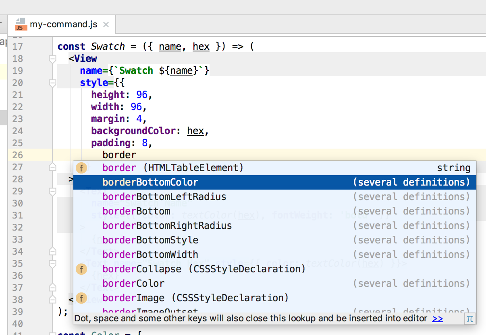

# Community Provided Tooling

> NOTICE: Keep that mind that the following section is *not* written by the maintainers of this project.

## Code suggestions/intellisense

If your editor supports it, you can use the community-provided typings to get suggestions, auto complete, and intellisense in javascript.

Simply:

    npm install --save-dev @types/react-sketchapp

then reload the editor window.

You can get suggestions by hitting `Ctrl + space`

**VS Code**

**WebStorm**

**Atom**

Unfortunately, [atom-typescript package does *not* support code suggestions/intellisense in .js files](https://github.com/TypeStrong/atom-typescript/issues/1194) but the code suggestions do work in typescript files. See the example below for how to get typescript working.

## Typescript usage

Though there are more direct ways integrate typescript into react-sketchapp, a simple way is to just have the typescript compiler emit javascript `js` files and point the `manifest.json` to use the compiled javascript files.

[See the basic-setup-typescript for an example.](../../examples/basic-setup-typescript)
