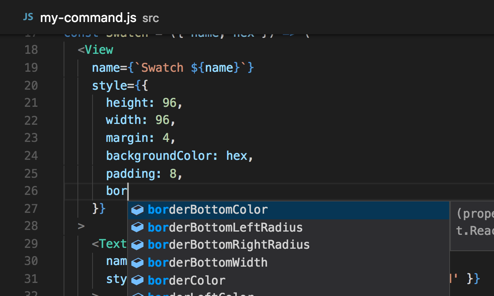

# Community Provided Tooling

> NOTICE: Keep that mind that the following section is *not* written by the maintainers of this project.

## Code suggestions/intellisense

If your editor supports it, you can use the community-provided typings to get suggestions, auto complete, and intellisense in javascript.

Simply:

    npm install --save-dev @types/react-sketchapp

then reload the editor window.

You can get suggestions by hitting `Ctrl + space`

**VS Code**



**WebStorm**


**Atom**

Unfortunately, [atom-typescript package does *not* support code suggestions/intellisense in .js files](https://github.com/TypeStrong/atom-typescript/issues/1194) but the code suggestions do work in typescript files.

## Typescript usage

Though there are probably better integrate typescript into react-sketchapp (via skpm), a simple way is to just have the typescript compiler emit javascript `jsx` files and point the `manifest.json` to use the compiled javascript files.

Here is a suggested `tsconfig.json`:

```json
{
  "compilerOptions": {
    "target": "es2015",
    "module": "es2015",
    "jsx": "preserve",
    "outDir": "./ts-compiled",
    "rootDir": "./src",
    "allowSyntheticDefaultImports": true
  },
  "include": [
    "./src/**/*"
  ]
}
```

